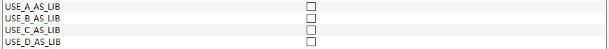
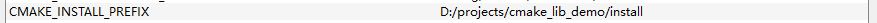
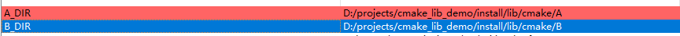

# A CMake Demo

## project structure

- testA
    - A
        - B
            - D
        - C
            - D

## Overview
 testA is exe project that use lib A, and A depends B,C. Both B and C depend D

### this demo shows how a executable consume lib with binary or source in a configurable way with CMake

## Usage

open CMake (download one if you don't have one installed)
configure this demo with the CMakelists.txt on the top level, you will see the checkboxs that use A/B/C/D as lib or source

with CMake generate ready, you do the followings

- uncheck all four checkbox, and build the solution, you can run testA now, with all four libs being introduced as source
- follow last step, you install the four libs ( cmake --build . --target install ), and don't forget to specify CMAKE_INSTALL_PREFIX to let CMake know where to install.

- with lib A/B/C/D installed(if last step went well),  you can check any box you like to choose A/B/C/D as lib to be consumed by the executable testA. if CMake can't find X-config.cmake(X for A/B/C/D), you then just specify the installed X-config.cmake  file directory as prompted so that CMake can find the binary and include files

